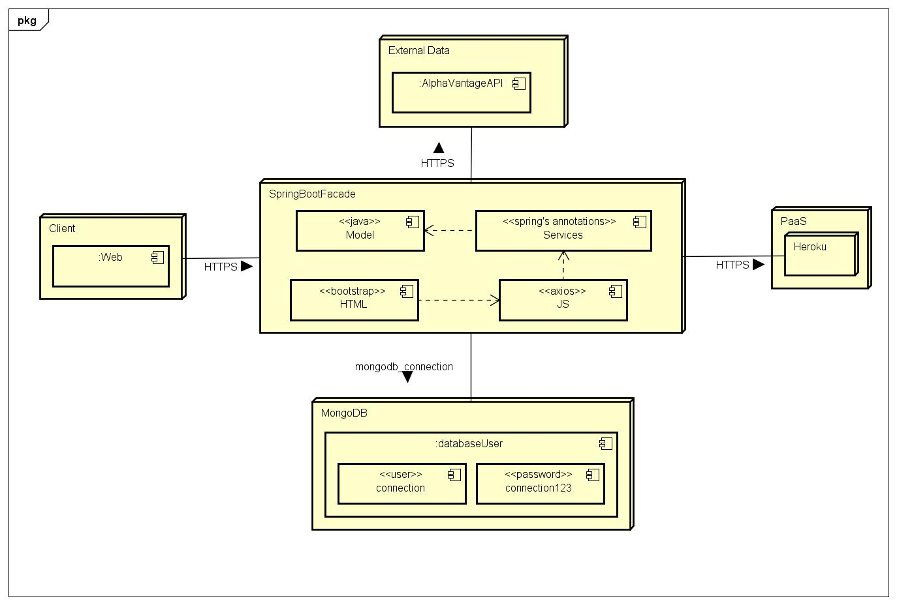

### Escuela Colombiana de Ingeniería
### Arquitecturas de Software (ARSW)
### Laboratorio Bases de Datos No-SQL

Su compañía lo ha seleccionado para construir una aplicación que demuestre una simple arquitectura de Microservicios desplegada en Heroku con bases de datos NoSql, para uno de los clientes más importantes.
Así, han decidido que usted debe construir una aplicación para consultar el mercado de valores de las acciones negociadas en Bolsa.  La aplicación recibirá el identificador de una acción, por ejemplo “MSFT” para Microsoft  y deberá mostrar el histórico de la valoración intra-día, diaria, semanal o mensual. Para esto utilice el API gratuito de https://www.alphavantage.co/documentation (Puede crear una cuenta para obtener la llave para realizar consultas). Se le pide que su implementación sea de alta disponibilidad, así que usted debe construir una base de datos de respaldo que se cargué en línea y que permita almacenar versiones de las respuestas dadas por el servicio externo. El sistema buscará primero una respuesta en la base de datos de respaldo y si no tiene respuesta irá al servicio externo. Utilice mongoDB para esta base de respaldo. Puede desplegar una instancia de MongoDB en mlab.com.
La arquitectura debe tener las siguientes características:
1. El cliente Web debe ser un cliente asíncrono que use servicios REST desplegados en Heroku y use Json como formato para los mensajes.
2. El servidor de Heroku servirá como un gateway para encapsular llamadas a otros servicios Web externos.
3. La aplicación debe ser multiusuario.
4. Todos los protocolos de comunicación serán sobre HTTP.
5. Los formatos de los mensajes de intercambio serán siempre JSON.
6. La interfaz gráfica del cliente debe ser los más limpia y agradable posible y debe utilizar Bootstrap. Para invocar métodos REST desde el cliente usted puede utilizar la tecnología que desee.
7. Debe construir un cliente Java que permita probar las funciones tanto el servidor fachada. El cliente utiliza simples conexiones http para conectarse a los servicios. Este cliente debe hacer pruebas de concurrencia en su servidor Spring.
8. Debe utilizar maven para gestionar el ciclo de vida, git y github para almacenar al código fuente y Heroku como plataforma de producción.
9. La base de datos debe ser MongoDB.
10. Documente su arquitectura en el README.md

### Documentación de la arquitectura

La arquitectura consiste en un REST API usando el framework de Springboot, que mediante anotaciones, hace las conexiones necesarias en esta MVC (model-view-controller) para que al ingresarle un dato a la vista (que usa bootstrap), esta llame a el controlador (el cual es un JavaScript que maneja mensajes JSON implementado en axios) para que se comunique con el modelo quien es que hace la consulta como tal (y el llamado al API externo de AlphaVantage).
Se hace uso de MongoDB para persistir datos No-SQL (los JSON).